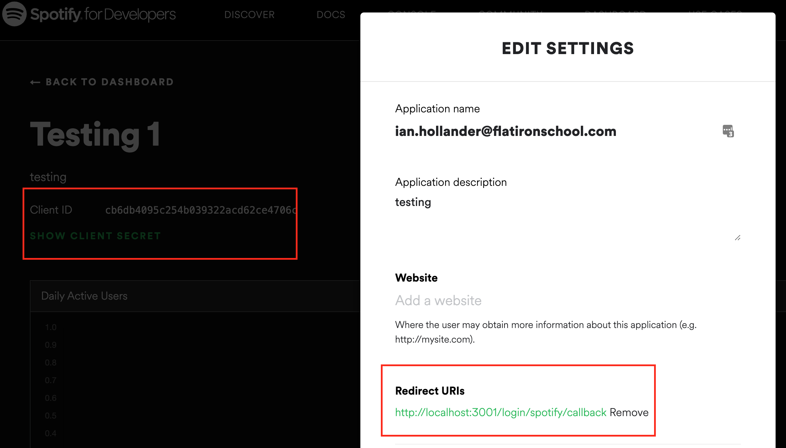

# OAuth

## Outline

- [ ] Discuss what OAuth is
- [ ] Visualize OAuth flow
- [ ] Implement OAuth in a React-Rails application

## Notes

- general help working with APIs
  - when do we save data to our DB? (is that data related to some model in data?)
- general knowledge

## What is OAuth?

OAuth, short for "Open Authorization", is a standardized way of authorizing
users, used in particular when you need to access resources from a third party
on behalf of a user. It is used as an alternative to API keys when you are
accessing resources from a particular _user_ rather than from a particular
_app_.

For example, you'll need to use OAuth in your application if you're building an
API that:

- posts tweets to a user's Twitter feed on their behalf; or
- adds songs to a user's Spotify playlist; or
- allows single sign-in from a user's Google account

## Grants: The OAuth Dance

Working with an API that uses OAuth requires working with one of these common
**grants** (a series of steps that are taken to authorize a user).

This is where things get tricky - in order for our application to communicate
with a third party site on behalf of a user in a secure way, we need to perform
a series of steps to communicate between our app and Spotify's authorization
server.

Based on the way our application is architected, we need to pick the right grant
flow for us. Here's a rundown of each common grant flow, and when you can use them:

- **Authorization Code Grant Flow**: In order to use this grant flow, we need to have
  a server where we can keep a special client secret code. For a single-page
  application with a separate API server, this is the flow we can use.
- **Authorization Code Grant Flow With Proof Key for Code Exchange (PKCE)**: for
  applications where we can't safely store a client secret, this is the
  recommended flow. Use this if you have a frontend-only application (no secure
  server).
- **Implicit Grant**: a simplified flow that also doesn't involve using a
  client secret. This is no longer recommended due to security risks; use
  the PKCE flow instead.
- **Client Credentials Grant**: used for server-to-server communication, where
  you don't need access to user-specific resources.

For our React/Rails applications, the grant flow we'll use is the
**Authorization Code Grant**, since we have a secure server where we can safely
keep a client secret code.

## Authorization Code Grant

Here are all the steps involved in using the Authorization Code Grant. In these
examples, we'll use Spotify as the OAuth provider, but the same general steps
apply across different providers.

- The user clicks a "sign in" button, and is directed to a consent page hosted
  by Spotify's authorization server.

- On that page, the user must agree to allow our site access to certain
  **scopes** (permissions, such as "reading the user's profile" or "deleting the
  user's playlists") in order to continue.

- After the user agrees, Spotify _redirects_ them back to our website. An
  **Authorization Code** is included in the URL for the redirect. The
  Authorization Code is only used for one thing: generating an access token in
  the next step.

- Using the **Authorization Code**, and a special **client ID** and **client
  secret**, our website asks Spotify to exchange the **Authorization Code**
  for an **Access Token** and a **Refresh Token**. Success!

- Whenever we need to perform some kind of action with Spotify's API on behalf
  of a user, we can do so using their **Access Token** to authorize their
  request.

- We'll also need to save the access token in the database to associate
  it with a user.

- For added security, Access Tokens are often short-lived. Spotify, for example,
  expires their access token after one hour! To get a new Access Token, we can
  use the **Refresh Token** to request a new Access Token from Spotify, rather
  than going through the whole Authorization Code Grant flow again.


### Authorization Code Grant in Code

First,
[create an application in Spotify](https://developer.spotify.com/dashboard/applications).
Here's what the setup looks like:



Take note of the **client id**, **client secret**, and **redirect URI**; we'll
need these in our Rails app.

> The user clicks a "sign in" button, and is directed to a consent page hosted by
> Spotify's authorization server.

Make a request to our Rails backend:

```js
<a href="http://localhost:3001/login/spotify">Login with Spotify</a>
```

Rails backend redirects to Spotify's authorization server, using the client ID
and redirect URI we set up with Spotify:

```rb
# routes.rb
get "/login/spotify", to: "users#spotify_redirect"

# users_controller.rb
def spotify_redirect
  query_params = {
    response_type: "code",
    client_id: "client_id_from_spotify",
    scopes: "user-read-private user-read-email",
    redirect_uri: "http://localhost:3001/login/spotify/callback"
  }

  redirect_to "https://accounts.spotify.com/authorize?#{query_params.to_query}"
end
```

> On that page, the user must agree to allow our site access to certain
> **scopes** (permissions, such as "reading the user's profile" or "deleting the
> user's playlists") in order to continue.

The user would see the consent screen here; so this step happens entirely with
Spotify's authorization server.

> After the user agrees, Spotify _redirects_ them back to our website. An
> **Authorization Code** is included in the URL for the redirect. The
> Authorization Code is only used for one thing: generating an access token in
> the next step.

Set up a route to handle the redirect URI, and a controller action and access
the code in params:

```rb
# routes.rb
get "/login/spotify/callback", to: "users#spotify_callback"

# users_controller.rb
def spotify_callback
  code = params[:code]
end
```

> Using the **Authorization Code**, and a special **client ID** and **client
> secret**, our website asks Spotify to exchange the **Authorization Code**
> for an **Access Token** and a **Refresh Token**. Success!

```rb
# users_controller.rb
def spotify_callback
  code = params[:code]
  response = RestClient.post("https://accounts.spotify.com/api/token", {
    grant_type: "authorization_code",
    code: code,
    redirect_uri: "http://localhost:3001/login/spotify/callback",
    client_id: "client_id_from_spotify",
    client_secret: "client_secret_from_spotify"
  })
  data = JSON.parse(response)
  # data has the access token and refresh token!
end
```

> Whenever we need to perform some kind of action with Spotify's API on behalf
> of a user, we can do so using their **Access Token** to authorize their
> request.

```rb
# users_controller.rb
def spotify_callback
  # get the access token
  code = params[:code]
  token_response = RestClient.post("https://accounts.spotify.com/api/token", {
    grant_type: "authorization_code",
    code: code,
    redirect_uri: "http://localhost:3001/login/spotify/callback",
    client_id: "client_id_from_spotify",
    client_secret: "client_secret_from_spotify"
  })
  token_data = JSON.parse(token_response)

  # use the access token to make requests on behalf of the user
  user_response = RestClient.get("https://api.spotify.com/v1/me", {
    Authorization: "Bearer #{token_data["access_token"]}"
  })
  user_data = JSON.parse(user_response)
end
```

> We'll also need to save the access token in the database to associate
> it with a user.

```rb

# users_controller.rb
def spotify_callback
  # get the access token
  code = params[:code]
  token_response = RestClient.post("https://accounts.spotify.com/api/token", {
    grant_type: "authorization_code",
    code: code,
    redirect_uri: "http://localhost:3001/login/spotify/callback",
    client_id: "client_id_from_spotify",
    client_secret: "client_secret_from_spotify"
  })
  token_data = JSON.parse(token_response)

  # use the access token to make requests on behalf of the user
  user_response = RestClient.get("https://api.spotify.com/v1/me", {
    Authorization: "Bearer #{token_data["access_token"]}"
  })
  user_data = JSON.parse(user_response)

  # find or create a user
  user = User.from_spotify_login(user_data, token_data)
  token = JWT.encode({ user_id: user.id }, 'mysecret', 'HS256')

  # redirect to frontend
  redirect_to "http://localhost:3000/users/#{token}"
end

# user.rb
class User < ApplicationRecord

  def self.from_spotify_login(user_data, token_data)
    User.where(spotify_id: user_data["id"]).first_or_create do |new_user|
      new_user.spotify_id = user_data["id"]
      new_user.access_token = token_data["access_token"]
      new_user.refresh_token = token_data["refresh_token"]
      new_user.expires_at = DateTime.now + token_data["expires_in"].seconds
      new_user.scope = token_data["scope"]
    end
  end

end
```

Back in the frontend, finally! Now we need to set up a route and a component
to handle the redirect from our backend, and log in a user:

```js
// App.js
<Route exact path="/users/:token">
  <SpotifyLogin setCurrentUser={setCurrentUser} />
</Route>;

// SpotifyLogin.js
function SpotifyLogin({ setCurrentUser }) {
  const { token } = useParams();
  const history = useHistory();

  useEffect(() => {
    if (token) {
      localStorage.setItem("token", token);
      fetch("http://localhost:3001/me", {
        headers: {
          Authorization: `Bearer ${token}`,
        },
      })
        .then((r) => r.json())
        .then((user) => {
          setCurrentUser(user);
          history.push("/");
        });
    }
  }, [token]);

  return <h1>Loading...</h1>;
}
```

Finally... a logged in user. Phew.

> For added security, Access Tokens are often short-lived. Spotify, for example,
> expires their access token after one hour! To get a new Access Token, we can
> use the **Refresh Token** to request a new Access Token from Spotify, rather
> than going through the whole Authorization Code Grant flow again.

Now that we have an access token, we can use it to make requests on behalf of
the user. For example, let's say we wanted to get access to the current user's
recently played songs:

```js
function RecentSongs() {
  const [songs, setSongs] = useState([]);

  useEffect(() => {
    const token = localStorage.getItem("token");
    fetch("http://localhost:3001/songs/recent", {
      headers: {
        Authorization: `Bearer ${token}`,
      },
    })
      .then((r) => r.json())
      .then(setSongs);
  }, []);

  // render the songs
}
```

In the backend:

```rb
# songs_controller

def recent_songs
  access_token = @current_user.access_token
  songs_response = RestClient.get("https://api.spotify.com/v1/me/player/currently-playing", {
    Authorization: "Bearer #{access_token}"
  })
  render json: songs_response
end
```

If the access token is expired, we won't get access to the data from the API. So we can check if the access token is expired first, then generate a new token for the user before trying to use it, using the refresh token:

```rb
# songs_controller
def recent_songs
  if @current_user.expires_at < DateTime.now
    @current_user.refresh_access_token!
  end
  access_token = @current_user.access_token
  songs_response = RestClient.get("https://api.spotify.com/v1/me/player/currently-playing", {
    Authorization: "Bearer #{access_token}"
  })
  render json: songs_response
end

# user.rb
def refresh_access_token!
  token_response = RestClient.post("https://accounts.spotify.com/api/token", {
    grant_type: "refresh_token",
    refresh_token: self.refresh_token,
    client_id: "spotify_client_id",
    client_secret: "spotify_client_secret"
  })
  token_data = JSON.parse(response)
  self.update(
    access_token: data["access_token"],
    expires_at: DateTime.now + token_data["expires_in"].seconds
  )
end
```

## Resources

- [What is OAuth 2?](https://auth0.com/intro-to-iam/what-is-oauth-2/)
- [Spotify Authorization Guide](https://developer.spotify.com/documentation/general/guides/authorization-guide/)
